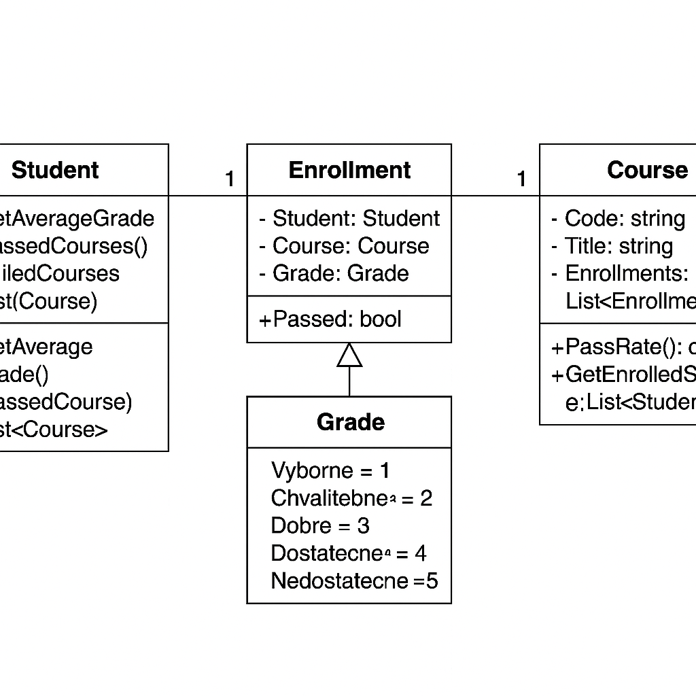

# Projekt Školní systém
# ČZU PEF, EIE82E - Objektové modelovaní - INFO2 2024/2025 KS
## Autor: Vilém Vicher
## Vyučující: Ing. Jiří Brožek, Ph.D.

### Použité třídy
- **Student** – reprezentuje studenta, obsahuje seznam zápisů a metody pro výpočet průměru a úspěšnosti.
- **Course** – reprezentuje předmět, uchovává seznam studentů a umožňuje vyhodnotit úspěšnost studentů.
- **Enrollment** – propojuje studenta a předmět s konkrétním hodnocením.
- **Grade (enum)** – výčet známek v rozsahu 1 (výborně) až 5 (nedostatečně).

### Diagram datového modelu


### Spuštění
Projekt je vytvořen v C#, používá .NET 9.0 a je možné ho spustit pomocí příkazu:

```bash
dotnet run
```